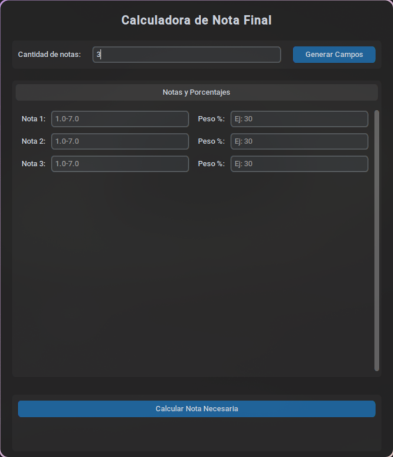

# NoteNeeds



Que nota necesitas para pasar


## Modo de uso
Ingresar las notas que te han dado y su peso (%), segun lo que pongas, el programa te dira que nota necesitarias en tu ultima solemne para pasar.

## Descarga
1. Clona este repositorio en tu máquina local: `git clone https://github.com/kapone-dev/neednotes`
2. Descargar customtkinter con "```pip install customkinter```"
2. Ejecuta el programa con python "```python main.py```"
